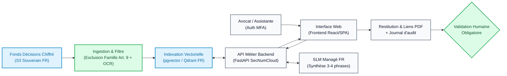

# Fiche de décision — Cabinet Maître Devalle (Cas A)

**Client :** Maître Devalle (12 avocats, TJ Bordeaux) · **Groupe :** Franck, Julien, Tom · **Cas A**

> **Livrable principal — Fiche de décision technique (3-4 pages max)**.  
> Conforme aux exigences du livrable M8-B2 pour présentation à un architecte technique.  
> Document unique consolidé : décisions de groupe, 5 arbitrages, architecture cible, évaluation, monitoring M6, conformité/sécurité et chiffrage.

---

## 1. Décisions de groupe (mardi 15h30-16h45)

| Divergence | Positions (qui pensait quoi) | Décision retenue | Pourquoi |
|---|---|---|---|
| **1. Place de la GenAI (RAG + SLM vs Moteur plein texte)** | **Franck :** RAG + SLM souverain dès V1.<br>**Julien :** Moteur d'abord, LLM en option 2.<br>**Tom :** Moteur plein texte sobre, 0 GenAI en V1. | **RAG avec SLM compact souverain (Mistral 7B / Llama 8B) borné à la synthèse comparative et explicative des extraits retrouvés (Option B).** | **Valeur d'usage métier démontrée :** évite aux avocats de lire 3 décisions intégrales de 15 pages ; le SLM produit un résumé factuel de 3-4 phrases expliquant la pertinence avec liens vers les pages et paragraphes exacts.<br>**Garde-fous anti-hallucination :** prompt d'ancrage strict (*grounding*) interdisant toute invention. Si aucun extrait ne répond, affichage de *« Aucune décision interne pertinente »*.<br>**Maîtrise financière :** requêtes courtes d'explication (< 20 €/mois d'inférence GPU managée pour ~10 requêtes/jour). |
| **2. Périmètre V1 (Courriers types)** | **Franck :** Inclus (recouvrement / baux).<br>**Julien :** Exclus (modèles 2019 obsolètes).<br>**Tom :** Exclus du logiciel (remise à plat organisationnelle). | **Recherche seule en V1. Exclusion des courriers types du périmètre initial.** | **Sécurité juridique & dette documentaire :** les modèles partagés datent de 2019 et ne sont plus maintenus ; automatiser des courriers sur une base obsolète créerait un risque d'erreur de droit immédiat.<br>**Priorité métier exprimée :** Maître Devalle a indiqué que *« c'est surtout la recherche qui prend du temps »*. Les courriers feront l'objet d'une remise à niveau humaine des gabarits avant d'envisager une phase 2. |
| **3. Données sensibles & Famille (art. 9 RGPD)** | **Franck :** Exclure la famille + pseudonymisation.<br>**Julien :** Intérêt légitime global.<br>**Tom :** Alerte art. 9 / mineurs, validation DPO requise. | **Exclusion formelle du droit de la famille du périmètre V1.** Focus exclusif sur les contentieux économiques et patrimoniaux (recouvrement, baux commerciaux, sociétés) avec pseudonymisation des PII. | **Conformité RGPD et minimisation du risque juridique :** les affaires familiales concentrent des données hautement sensibles (art. 9 RGPD : santé, mœurs, situations familiales conflictuelles) et des données de mineurs. L'exclusion élimine le risque d'infraction sans bloquer le lancement en attendant une consultation DPO lourde. Les baux et recouvrements représentent déjà plus de 50 % du volume utile. |
| **4. Prise en compte de l'imprévu IT (31/12)** | **Franck & Julien :** PaaS/SaaS managé FR.<br>**Tom :** Pré-requis bloquants avant le 31/12 (sauvegarde + accès). | **Cible : Cloud souverain managé FR (SecNumCloud) avec intégration de l'alerte opérationnelle de Tom en Jalon 0 impératif.** | **Stratégie en 2 temps :**<br>1. *Jalon 0 (avant le 31/12 — Alerte Tom)* : Test réel d'une restauration complète des sauvegardes, récupération documentée des accès racine, et révocation formelle des accès du prestataire sortant.<br>2. *Cible pérenne (Franck/Julien)* : Déploiement sur un PaaS/SaaS souverain infogéré (ex. OVHcloud / Scaleway) avec DPA strict et sauvegardes automatiques pour pallier l'absence définitive d'administrateur système interne au cabinet. |
| **5. Cible du KPI gain de temps** | **Franck & Julien :** 1h / jour / avocat.<br>**Tom :** 20-25 min / jour / avocat (calcul réel). | **Cible réaliste retenue à 20-25 minutes / jour / avocat pour la V1 (recherche seule).** | **Rigueur de calcul et crédibilité professionnelle :** sur la base des ~10 recherches quotidiennes estimées à 30 minutes, le gain maximal théorique est de 5 heures par jour pour l'ensemble du cabinet, soit ~25 min/avocat/jour si la recherche passe à moins d'1 minute. Promettre 1 heure complète sans automatiser les courriers est mathématiquement intenable. L'objectif d'une heure sera réservé comme cible globale si la V2 intègre l'assistance aux courriers. |

---

## 2. Les 5 arbitrages techniques

| Arbitrage | Choix — ou « non applicable » | Raisons (≥ 1 chiffrée) | On changerait d'avis si… |
|---|---|---|---|
| **ML classique vs deep learning** | **Deep Learning (Embeddings denses)** | 1. 2 000 décisions juridiques non labellisées : le ML classique supervisé est inapplicable sans jeu d'entraînement annoté.<br>2. Les embeddings sémantiques (bge-m3 / CamemBERT) capturent les synonymies juridiques complexes là où TF-IDF échoue.<br>3. Coût de calcul négligeable : inférence d'embedding réalisable sur CPU standard (< 30 ms / requête). | On changerait d'avis si les requêtes des avocats se limitaient strictement aux 5 métadonnées structurées du registre CSV (numéro, juridiction, date, matière, issue). |
| **SLM vs LLM** | **SLM souverain (Mistral 7B / Llama 8B)** | 1. Tâche atomique de synthèse factuelle (3-4 phrases) ne nécessitant pas les 70B+ paramètres d'un modèle frontière.<br>2. Maîtrise financière : coût d'inférence < 20 €/mois pour 10 requêtes/jour (vs > 250 €/mois pour un cluster LLM dédié).<br>3. Disponibilité sur des infrastructures managées françaises garantissant la conformité déontologique. | On changerait d'avis si l'outil devait rédiger des mémoires juridiques complexes multi-pages avec analyse comparative doctrinale approfondie. |
| **RAG oui / non** | **OUI (RAG avec ancrage strict)** | 1. Corpus interne fermé et confidentiel de 2 000 décisions inconnu des modèles pré-entraînés du marché.<br>2. Déontologie : 0 tolérance d'hallucination (garantie par le *grounding* qui injecte les extraits vérifiables dans le prompt).<br>3. Mise à jour continue : indexation immédiate des nouvelles décisions sans réentraînement de modèle. | On changerait d'avis si les décisions étaient intégralement publiées et déjà indexées dans les bases publiques sous abonnement du cabinet. |
| **Agents oui / non** | **NON (Pipeline RAG linéaire)** | 1. Tâche unitaire et déterministe (Requête $\rightarrow$ Recherche $\rightarrow$ Synthèse $\rightarrow$ Affichage), sans boucle d'action ni décision autonome.<br>2. Élimination du sur-engineering : un orchestrateur agentique multiplierait la latence par 4-5 (10-15 s vs 2 s) et les coûts par 3.<br>3. Sécurité déontologique : aucun droit d'écriture ni action non supervisée sur les dossiers clients. | On changerait d'avis si l'outil devait naviguer de manière autonome entre 3 logiciels distincts (base interne, RPVA, logiciel de gestion de cabinet). |
| **Zero-shot suffit ?** | **OUI (Zero-shot avec prompt engineering strict)** | 1. 0 donnée d'entraînement labellisée existante pour fine-tuner un modèle juridique.<br>2. Économie de Build : économise ~15 jours·homme d'annotation experte par des avocats (soit > 10 000 € préservés sur le budget de 15 000 €).<br>3. La structuration du prompt avec délimiteurs XML et consigne négative formelle suffit à borner la synthèse aux extraits injectés. | On changerait d'avis si les évaluations initiales montraient un taux de fidélité textuelle inférieur à 95 % sur les termes techniques de procédure. |

---

## 3. Architecture finale et sobriété

Le schéma détaillé complet est documenté dans [schema_archi_cible.md](schema_archi_cible.md).



**Description synthétique (3-4 lignes) :**  
L'architecture découple l'ingestion batch sécurisée (avec exclusion des affaires familiales et désensibilisation PII) et le moteur de recherche en ligne. La requête de l'avocat interroge un index dense souverain ; les extraits pertinents alimentent un SLM compact managé en France qui produit une explication factuelle de 3 phrases liée aux PDF originaux. L'avocat relit et valide obligatoirement le document source avant toute exploitation juridique.

**Ce que nous n'avons PAS mis (Sobriété assumée) :**
- **Pas de framework agentique (LangGraph, CrewAI) :** pipeline linéaire déterministe sans boucle autonome, réduisant la latence (< 2 s) et supprimant tout risque d'effet de bord sur le SI.
- **Pas de LLM propriétaire américain (OpenAI, Anthropic) :** respect absolu du secret professionnel (art. 66-5) et immunité totale contre le CLOUD Act américain.
- **Pas de module de génération automatique de courriers :** fonds de modèles 2019 obsolète écarté de la V1 pour éviter la propagation d'erreurs juridiques.
- **Pas de GPU dédié sur site :** inférence déléguée à une API managée souveraine pour pallier l'absence totale d'administrateur informatique au cabinet dès le 31 décembre.
- **Pas de fine-tuning :** zéro budget gaspillé en annotation supervisée, tenue stricte dans l'enveloppe de 15 000 €.

---

## 4. Évaluation

Avant toute mise en service auprès des 12 avocats, le système sera évalué sur un banc de test représentatif validé par Maître Devalle :

1. **Baseline simple à battre :**  
   Recherche textuelle par mot-clé (grep / recherche Windows actuelle du serveur local).  
   *Seuil de baseline :* temps moyen de 30 minutes, taux de succès estimé à 35 % (les décisions étant mal nommées : `decision_1004.pdf`).

2. **Jeu de test et découpage :**  
   Constitution d'un jeu d'évaluation « Golden Dataset » de **50 requêtes réelles** rédigées par 3 avocats associés, couvrant les contentieux baux commerciaux et recouvrement.  
   Découpage temporel : les décisions de 2010 à 2023 forment le corpus de recherche, les requêtes portent sur des dossiers traités en 2024-2025 pour tester la généralisation sans fuite temporelle.

3. **Métriques d'évaluation alignées métier :**
   - **Retrieval :** *Recall@3* $\ge 90\,\%$ (la décision pertinente recherchée doit figurer dans les 3 premiers résultats remontés).
   - **Génération (RAG Triad) :**
     - *Fidélité au contexte (Groundedness) :* $100\,\%$ (zéro fait ou article de loi inventé hors du contexte fourni).
     - *Pertinence de la synthèse :* score qualitatif $\ge 4/5$ attribué par un binôme d'avocats sur les 50 requêtes test.

---

## 5. Déploiement et monitoring (Héritage M5 / M6)

### Déploiement & Rollback (M5)
- **Environnement :** Conteneur Docker léger déployé sur un PaaS souverain français qualifié SecNumCloud (Scaleway / OVHcloud).
- **Stratégie de déploiement :** Déploiement *Blue/Green* via CI/CD automatisée avec tests unitaires de non-régression sur le Golden Dataset de 50 requêtes.
- **Rollback :** En cas d'anomalie ou d'indisponibilité de l'API SLM, bascule instantanée en mode dégradé *Retrieval Pur* (affichage des 3 extraits bruts et liens PDF, sans synthèse rédigée).

### Tableau de monitoring (M6)

| Question | Métrique | Seuil d'alerte | Alerte vers | Action corrective |
|---|---|---|---|---|
| **En vie ?** | Disponibilité API (Uptime HTTP 200) & Latence P95 | Disponibilité < 99,5 % sur 1h ou Latence > 4 s | Infogéreur Cloud & Référent cabinet | Redémarrage conteneur / Bascule fallback retrieval pur. |
| **Prédit bien ?** | Taux de requêtes sans résultat ("Zero-result rate") | > 15 % des requêtes sur 7 jours consécutifs | Équipe projet FastIA | Analyse des logs de requêtes : vocabulaire métier manquant ou lacune documentaire. |
| **Données qui dérivent ?** | Dérive du vocabulaire (Data Drift sur requêtes) & Score similarité moyen | Score moyen top-1 < 0.65 sur 20 requêtes | Architecte IA | Mise à jour des embeddings ou ajout de métadonnées de cadrage juridique. |
| **Sécurité / Éthique** | Tentatives de requêtes sur contentieux exclus (Droit famille) | > 1 tentative par jour | DPO / Référent interne | Rappel à l'ordre utilisateur et vérification de l'étanchéité du filtre RGPD. |

---

## 6. Conformité et sécurité

### Qualification AI Act & RGPD
- **AI Act :** **Système sans obligation spécifique (hors Annexe III et art. 5)**. L'outil est strictement interne, ne conseille aucun justiciable directement et n'émane pas d'une autorité judiciaire. Obligation de transparence respectée : interface indiquant clairement la nature artificielle de l'assistant (art. 50) et formation des utilisateurs (art. 4).
- **RGPD :** **Intérêt légitime** (art. 6 §1 f) pour l'organisation interne du cabinet combiné à l'**exécution du mandat client** (art. 6 §1 b). Article 22 non applicable : décision non exclusivement automatisée (boucle humaine systématique par l'avocat signataire).
- **Données sensibles (Art. 9) :** Neutralisées par l'exclusion formelle du droit de la famille et la désensibilisation des PII.

### Matrice de sécurité du modèle

| Menace retenue | Plausibilité sur ce cas | Réponse dans l'architecture | Risque résiduel |
|---|---|---|---|
| **Interruption de service (Fin contrat IT 31/12)** | 🔴 Maximale (serveur local sans admin) | Migration cloud managé souverain + **Jalon 0 avant le 31/12** (sauvegarde testée, accès récupérés et révoqués). | Résiduel très faible : délai de transmission des archives par le prestataire sortant. |
| **Violation du secret professionnel** | 🔴 Élevée (données judiciaires sensibles) | Hébergement SecNumCloud FR, chiffrement AES-256 / TLS 1.3, DPA interdisant tout réentraînement. | Résiduel nul côté hébergeur ; dépend du mot de passe fort côté avocat (mitigé par MFA). |
| **Hallucination / Fausse jurisprudence** | 🔴 Élevée (risque intrinsèque LLM) | RAG à ancrage strict (*grounding*) interdisant l'extrapolation, fallback si similarité < 0.72, lien direct PDF. | Résiduel minime : mauvaise interprétation d'une décision ambiguë par le SLM (couvert par relecture humaine). |
| **Injection indirecte de prompt** | 🟠 Moyenne (pièces adverses indexées) | Sanitization textuelle des PDF, délimiteurs XML stricts dans le prompt, droits nuls en écriture. | Consigne altérant le style de la synthèse sans masquer les pièces réelles. |

---

## 7. Coûts (Ordres de grandeur sur la volumétrie réelle)

*Volumétrie réelle : 12 avocats, ~10 recherches de décisions par jour ouvré, soit ~220 requêtes/mois sur un fonds de 2 000 décisions.*

| Poste de coût | Estimation financière | Hypothèses de calcul |
|---|---|---|
| **Build — Jalon 0 & Migration IT** | **1 800 €** (2 j·h) | Récupération accès, test restauration sauvegarde serveur local, export chiffré vers S3. |
| **Build — Ingestion, OCR & RAG** | **9 000 €** (10 j·h) | Pipeline OCR, anonymisation PII, chunking, configuration pgvector et prompt engineering strict. |
| **Build — Interface Web & Recette** | **3 600 €** (4 j·h) | Interface FastAPI/React sobre, intégration MFA, tests sur Golden Dataset de 50 requêtes. |
| **Total Build** | **14 400 €** | **Respecte l'enveloppe ferme de 15 000 €** (marge de sécurité de 600 €). |
| **Run — Stockage S3 & Base Vectorielle** | **~25 € / mois** | 2 000 documents (~10 Go de PDF chiffrés) + base PostgreSQL pgvector managée petite instance. |
| **Run — Inférence SLM souverain** | **~15 € / mois** | 220 requêtes/mois $\times$ ~1 500 tokens entrée/sortie $\times$ tarif API managée FR (~0,004 €/1k tokens). |
| **Run — Hébergement Web & Sauvegardes** | **~40 € / mois** | Conteneur managé infogéré avec sauvegardes automatiques quotidiennes. |
| **Total Run récurrent** | **~80 € / mois** | **Très inférieur au plafond client** de « quelques centaines d'euros par mois ». |

---

## ⭐ Optionnel — Pseudo-code du composant critique

```text
fonction executer_recherche_rag(question_utilisateur, filtre_matiere):
    # 1. Vérification sécurité et sanitization
    question_nettoyee = assainir_texte(question_utilisateur)
    si detecter_tentative_injection(question_nettoyee):
        journaliser_alerte_securite(question_nettoyee)
        retourner MessageErreur("Requête invalide.")

    # 2. Vectorisation de la question sur CPU
    vecteur_question = calculer_embedding(question_nettoyee)

    # 3. Recherche vectorielle avec filtre de matière
    extraits_candidats = base_vectorielle.rechercher(
        vecteur=vecteur_question,
        filtre={"matiere": filtre_matiere},
        top_k=3,
        seuil_similarite=0.72
    )

    # 4. Fallback nominal si confiance insuffisante
    si taille(extraits_candidats) == 0:
        journaliser_recherche(question_nettoyee, statut="ZERO_RESULT")
        retourner ReponseMetier(
            synthese="Aucune décision interne pertinente ne correspond à votre recherche.",
            sources=[]
        )

    # 5. Construction du prompt système avec ancrage strict (Grounding)
    prompt_systeme = """Tu es un assistant juridique interne strict. 
    Réponds en 3 phrases maximum en te basant EXCLUSIVEMENT sur les extraits fournis.
    Interdiction formelle de citer un fait ou une règle non mentionné.
    Cite pour chaque affirmation la décision et le paragraphe exacts."""
    
    contexte_documentaire = formater_en_balises_xml(extraits_candidats)
    prompt_final = assembler(prompt_systeme, contexte_documentaire, question_nettoyee)

    # 6. Génération de la synthèse par le SLM managé souverain
    synthese_explicative = appeler_slm_souverain(prompt_final, temperature=0.0)

    # 7. Journalisation immuable de l'accès (audit secret professionnel)
    journaliser_audit(
        id_utilisateur=utilisateur_courant.id,
        hash_requete=calculer_hash(question_nettoyee),
        decisions_citees=[e.decision_id pour e dans extraits_candidats]
    )

    retourner ReponseMetier(
        synthese=synthese_explicative,
        sources=[{"id": e.decision_id, "lien_pdf": e.url_s3, "score": e.score} pour e dans extraits_candidats]
    )
```

---

## Annexe — 5 questions prévues pour l'oral du jury

| # | Question probable du jury | Réponse préparée (2-3 lignes) | Qui répond |
|---|---|---|---|
| **1** | *« Si votre V1 ne traite que de la recherche et pas de courriers, pourquoi mettre un SLM au lieu d'une simple recherche par mot-clé ? »* | La recherche par mot-clé échoue sur des décisions mal nommées (`decision_1004.pdf`) ou des synonymes juridiques. Le SLM n'est pas un rédacteur libre : il fournit une explication de pertinence en 3 phrases qui évite à l'avocat d'ouvrir 3 PDF de 15 pages pour chaque question. On passerait au retrieval pur si le budget d'inférence dépassait 100 €/mois. | **Franck** |
| **2** | *« Comment garantissez-vous que le modèle n'invente jamais de jurisprudence, engageant la responsabilité civile du cabinet ? »* | Par une triple barrière : un seuil de similarité stricte (0.72) en dessous duquel le modèle s'abstient (*fallback* automatique), un prompt système fermé avec température 0 interdisant toute extrapolation, et l'affichage obligatoire du lien cliquable vers le PDF source relu par l'avocat signataire. | **Julien** |
| **3** | *« Pourquoi exclure les courriers et le droit de la famille alors que le client le demandait dans l'entretien ? »* | Priorisation par le risque et la valeur : les courriers reposent sur des modèles obsolètes de 2019 qui induiraient des erreurs de droit ; le droit de la famille concentre des données sensibles (art. 9 RGPD et mineurs). Baux et recouvrement représentent déjà plus de 50 % du contentieux et sécurisent le ROI sans exposition juridique inutile. | **Tom** |
| **4** | *« Que se passe-t-il concrètement le 31 décembre quand le prestataire informatique s'en va ? »* | C'est l'objet de notre Jalon 0 impératif : avant le 31/12, nous validons une restauration complète de la sauvegarde sur un stockage souverain managé (S3 FR) et révoquons les accès du prestataire sortant. Dès lors, le cabinet n'a plus besoin d'administrateur système sur site puisque toute l'application tourne sur un PaaS infogéré. | **Tom** |
| **5** | *« Votre gain de temps de 25 min/jour est loin de l'heure promise par Maître Devalle. Pourquoi ce chiffre ? »* | Par honnêteté intellectuelle et rigueur de calcul : 10 recherches quotidiennes à 30 minutes représentent 5 heures pour l'ensemble du cabinet, soit ~25 minutes par avocat si la recherche passe à 1 minute. Promettre 1 heure sans automatiser les courriers était faux. L'heure de gain sera l'objectif de la V2 quand les gabarits de courriers auront été assainis. | **Franck** |
