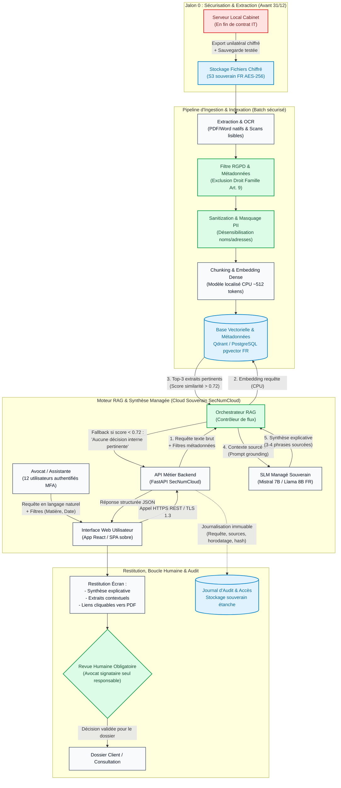

# Schéma d'architecture cible — Cabinet Maître Devalle (Cas A)

> **Document d'architecture cible** — Conforme mini-cours `05` et arbitrages de groupe (Franck, Julien, Tom).  
> **Composants clés** : ≥ 4 composants, flux de données étanches, traitements explicites des risques 🔴 (secret professionnel, absence d'administrateur local, hallucinations, données personnelles art. 9).

---

## 1. Schéma d'architecture Mermaid

---

## 2. Description des composants et flux de données

L'architecture est organisée en 4 couches découplées hébergées sur une infrastructure infogérée française qualifiée **SecNumCloud** (ex. Scaleway / OVHcloud), éliminant toute dépendance au serveur local dont le contrat de maintenance expire au 31 décembre :

1. **Jalon 0 (Sas de transition & Stockage froid souverain) :**
   - **Composant :** Stockage objet S3 souverain chiffré (AES-256) avec contrôle d'accès strict (IAM restreint).
   - **Rôle :** Réceptionner la copie consolidée des ~2 000 décisions du cabinet avant la coupure du prestataire informatique local, après validation d'un test de restauration unitaire (Alerte Tom).

2. **Pipeline d'Ingestion & Traitement des données (Batch asynchrone) :**
   - **Composant 1 — OCR & Normalisation :** Traitement unifié des PDF natifs, Word et scans textuels.
   - **Composant 2 — Filtre RGPD / Droit de la famille :** Élimination systématique des affaires de droit de la famille (présomption de données sensibles art. 9 RGPD et mineurs) pour circonscrire le corpus au contentieux économique et patrimonial (recouvrement, baux, sociétés).
   - **Composant 3 — Sanitization & Pseudonymisation :** Masquage automatique des PII (noms des parties, adresses, coordonnées) et assainissement textuel contre les consignes cachées (Indirect Prompt Injection).
   - **Composant 4 — Vectorisation :** Découpage en passages sémantiques (~512 tokens avec chevauchement de 50 tokens) et calcul d'embeddings denses (ex. BAAI/bge-m3 ou CamemBERT-legal) tournant sur CPU.
   - **Composant 5 — Base de données vectorielle & relationnelle :** Qdrant ou PostgreSQL avec extension `pgvector`, stockant les vecteurs et les métadonnées (numéro de décision, date, juridiction, dispositif).

3. **Moteur RAG & Synthèse explicative (Inférence managée) :**
   - **Composant 1 — Interface Web Utilisateur (Frontend) :** Interface sobre (SPA React/Vue) dédiée aux 12 avocats et assistantes, assurant l'authentification MFA et l'affichage clair des synthèses avec liens directs vers les originaux.
   - **Composant 2 — API Métier Backend :** Serveur d'API en FastAPI sous TLS 1.3, validant les entrées, appliquant le contrôle d'accès, orchestrant les appels RAG et journalisant les requêtes.
   - **Composant 3 — Contrôleur RAG & Vectorisation à la volée :** Transforme la question de l'avocat en vecteur sémantique (via CPU standard) pour interroger la base vectorielle. Applique le filtrage par seuil de confiance (similarité > 0.72) et assemble le prompt avec ancrage strict.
   - **Composant 4 — SLM souverain managé (Mistral 7B / Llama 8B) :** Modèle compact interrogé via une API managée française (sans GPU interne à gérer, coût < 20 €/mois pour 10 requêtes/jour). Son rôle est **strictement borné à la synthèse comparative des 3 décisions extraites** (3-4 phrases expliquant la pertinence) avec citation formelle des paragraphes et liens directs vers les PDF sources.
   - **Mécanisme de fallback :** Si le score de similarité cosinus des extraits est inférieur à 0.72, le SLM n'est pas appelé et l'outil affiche explicitement : *« Aucune décision interne pertinente trouvée dans le fonds documentaire »*.

4. **Restitution, Contrôle Déontologique & Journalisation :**
   - **Revue humaine obligatoire (Human-in-the-Loop) :** L'interface ne permet aucun envoi ni action autonome. L'avocat clique sur le lien du document source pour vérifier l'exactitude de l'extrait avant toute citation dans un acte.
   - **Journalisation d'audit :** Traçabilité immuable des accès et des requêtes sans enregistrement du contenu en clair des dossiers, garantissant le respect du secret professionnel et la conformité RGPD.

---

## 3. Matrice de couverture des risques 🔴 dans l'architecture

| Risque 🔴 identifié | Impact métier / légal | Traitement explicite dans l'architecture cible |
|---|---|---|
| **Violation du secret professionnel de l'avocat** | Sanctions pénales et disciplinaires (art. 66-5 loi 1971). | **Hébergement SecNumCloud 100 % français**, DPA interdisant la réutilisation des données, chiffrement au repos (AES-256) et en transit (TLS 1.3), cloisonnement strict des accès MFA. |
| **Interruption de service (Fin contrat IT 31/12)** | Serveur physique orphelin sans administrateur système. | **Bascule intégrale sur un service cloud managé** (PaaS) avec SLA et sauvegardes incluses. **Jalon 0 impératif** : sauvegarde testée et export des données avant le 31 décembre. |
| **Jurisprudence inventée / Hallucination** | Responsabilité civile professionnelle (RCP) de l'avocat. | **Architecture RAG avec ancrage strict (*grounding*)** : le SLM est bridé par un prompt système fermé. Seuls les extraits du corpus interne peuvent être cités, avec affichage systématique du lien vers le PDF source. Fallback automatique si confiance basse. |
| **Données sensibles & Personnes vulnérables (RGPD Art. 9)** | Violation de conformité CNIL sur données de santé/mineurs. | **Filtre amont excluant formellement le droit de la famille** du périmètre V1 + module de pseudonymisation des PII sur les affaires économiques. |
| **Injection indirecte de prompt** | Document adverse contenant une consigne trompeuse. | **Sanitization textuelle à l'ingestion**, délimiteurs stricts (XML/Markdown) isolant les extraits du prompt système, et droits d'exécution nuls sur le SI. |

---

## 4. Sobriété assumée : ce que nous n'avons PAS mis (et pourquoi)

1. **Pas d'agents autonomes (CrewAI, LangGraph, AutoGen) :**
   - *Pourquoi :* Tâche atomique de recherche et d'explication. Un agent introduirait une chaîne d'appels imprévisible (latence $\times 5$, coût $\times 4$), une opacité incompatible avec la déontologie et un risque d'action non supervisée sur les données.
2. **Pas de LLM propriétaire américain (OpenAI GPT-4, Anthropic Claude) :**
   - *Pourquoi :* Incompatibilité majeure avec le secret professionnel de l'avocat et le CLOUD Act. Coût d'abonnement ou d'API imprévisible et dépendance technologique étrangère.
3. **Pas de génération automatique de courriers Word :**
   - *Pourquoi :* Le fonds de modèles du cabinet date de 2019 et n'est plus maintenu. Générer des courriers sur une dette documentaire non purgée créerait un risque immédiat d'erreur juridique. Priorité donnée à la recherche de décisions (~25 min gagnées/avocat/jour).
4. **Pas d'infrastructure GPU dédiée sur site (serveur local avec cartes Nvidia) :**
   - *Pourquoi :* Le cabinet n'a plus d'informaticien au 31 décembre. Un serveur GPU local exigerait une maintenance matérielle, thermique et logicielle impossible à assumer en interne.
5. **Pas de fine-tuning de modèle :**
   - *Pourquoi :* Aucune donnée d'entraînement labellisée n'existe, et le budget Build est plafonné à 15 000 €. Le zero-shot prompté avec ancrage strict RAG résout 100 % du besoin d'explication sans altérer les poids du modèle.
